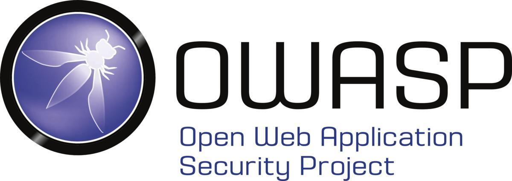

# Hacking Guide For Script Kiddies  

>

>

## What is it?

>
>This is my study plan for going from zero knowledge (self-taught) to be an Omniscient.
>

>
> Created this as a cheat sheat for any script kiddies to study any security related topics
---

## Table of Contents

### 1st Year (2020)

- [What is it?](#what-is-it)
- [Why use it?](#why-use-it)
- [How to use it?](#how-to-use-it)
- [Everything you need to know about Programming](#everything-you-need-to-know-about-programming)
- [Hack like a Pro](#hack-like-a-pro)

### 2nd Year (2021)

- [Hack The Box](#hack-the-box)
- [OWASP](#owasp)
- [Portswigger](#portswigger)
- [Bug Bounty](#bug-bounty)

# 1st Year

## Why use it?

When I started this project, I didn't know about absolutely anything, didn't know Coding or even Hacking.

It's a long plan. It may take years. If you are familiar with a lot of this already it will take you a lot less time.

## How to use it?

Open any repositories that you interested and *read* it, It's already have guide on how to tackle the topics.

## Everything you need to know about Programming

In 2016, I have been nominated to be a Malaysia National Coding Challenge Champion. And you know what? I only code using my mother smartphone rather than using laptop/pc. It's really hard when you don't have any sufficient resources. Yet, you still need to keep moving forward. Don't give up and always trust the process. Now, I learn that everything is open-sourced. So here are repositories that may help you in learning by yourself :)

- [ ] [Repo related to programming](https://github.com/g3nj1z/everything-you-need-to-know-about-programming)

## Hack like a Pro

I learn the hard way

- [ ] [Repo related to hacking](https://github.com/g3nj1z/hack-like-a-pro)

# 2nd Year
After a year of exploring in security. I have become lazy to copy and paste. Instead, I'll put the links that will help to go through the related topics.

## Hack The Box

- [ ] [Notes related to HTB](https://github.com/g3nj1z/htb)

## OWASP

- [ ] [Notes related to OWASP](https://github.com/g3nj1z/owasp)

## Portswigger

- [ ] [Notes related to Portswigger](https://github.com/g3nj1z/portswigger)

## Bug Bounty

- [ ] [My notes about bug bounty](https://github.com/g3nj1z/bug-bounty)
